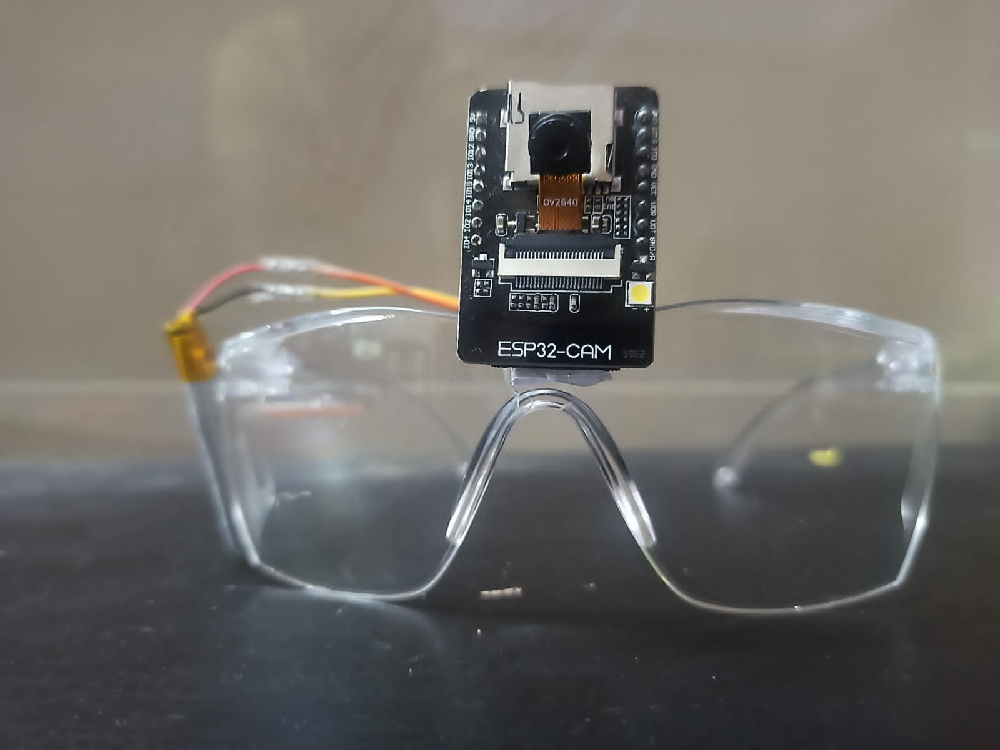
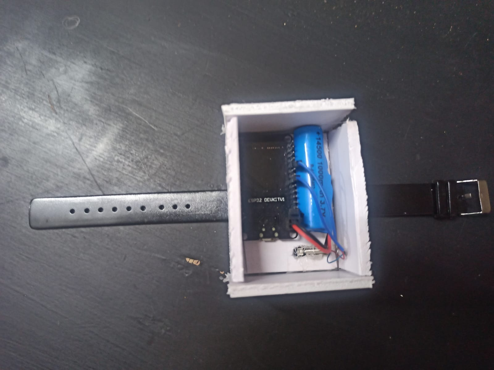
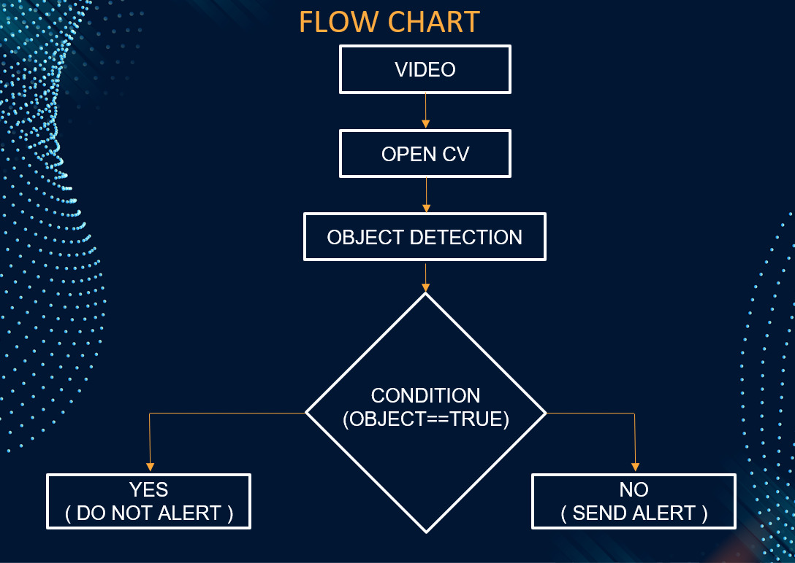
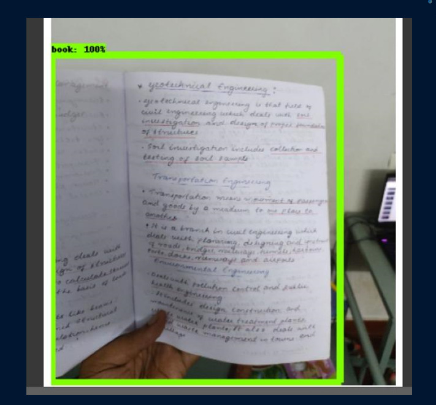

# Smart Study Glasses — ESP32-CAM + YOLOv8 Focus Monitoring System

The **Smart Study Glasses** project is designed to improve concentration and reduce distractions during study sessions.  
The system uses an **ESP32-CAM** attached to a pair of glasses to monitor whether the user is actually looking at a book.  
If the user gets distracted or stops studying, the system alerts them through a **vibrating smart band** powered by another ESP32.

---

## 🎥 Smart study glasses




---

## 🛠 How the System Works

### **1️⃣ ESP32-CAM on Glasses — Live Video Capture**
- An **ESP32-CAM** module is mounted on the glasses.
- It streams live video to the system over WiFi.
- The video shows what the user is looking at during study.

### **2️⃣ Book Detection Using YOLOv8**
- The live video is processed by the Python script:  
  **`smartstudyglasses.py`**
- A **custom-trained YOLOv8 model** detects if a book is present in front of the user.
- If **book is detected → user is studying**  
- If **no book detected → user is distracted**

### **3️⃣ Wearable Smart Band Alert System**
- A second ESP32 is mounted on a wearable wristband.
- It contains:
  - ESP32 board  
  - Vibrating motor  
- When the system detects distraction, it sends a wireless signal to the band.
- The band vibrates continuously until the user looks at the book again.

### **4️⃣ Study Session Timer Feature**
- User can set a **study duration limit**.
- After the time limit finishes:
  - The smart band gives a *short vibration*  
  - Reminds user to take a break  
- Helps prevent fatigue and boosts overall productivity.

---

## 📸 Images & Visuals

### ** Smartband**


### **System Flowchart**


### **Book Detection Demo (YOLOv8)**  


---

## 📂 Repository Structure
```bash
📁 esp32/ → Code for the smart band ESP32 
📁 esp32_cam/ → Code for the ESP32-CAM 
📄 smartstudy_glasses.py → Python script for YOLOv8 book detection
📄 smartstudyglasses.jpg 
📄 smartband.jpg 
📄 flowchart.jpg 
📄 bookdetection.jpg 
📄 README.md 


```

## 🔧 Technologies Used

- **ESP32-CAM** (video streaming)  
- **ESP32 Dev Board** (vibration feedback band)  
- **YOLOv8** (custom trained for book detection)  
- **Roboflow** (dataset creation + augmentation)  
- **Python + OpenCV**  
- **Wireless communication (WiFi)**  
- **Vibration motor (alert system)**  

---

## 🚀 Key Features

- Real-time book detection  
- Alerts when user loses focus  
- Wearable vibration band  
- Study session break timer  
- Improves concentration 
- Fully wireless system  
- Compact and comfortable glasses-mounted camera  

---

## 📝 Setup Instructions

### 1️⃣ Program the ESP32-CAM
Upload the code from `esp32_cam/` using Arduino IDE.  
This sends live video over WiFi.

### 2️⃣ Program the Smart Band ESP32
Upload the code from `esp32/` to control the vibration motor.

### 3️⃣ Run Book Detection
```bash
python3 smartstudyglasses.py
